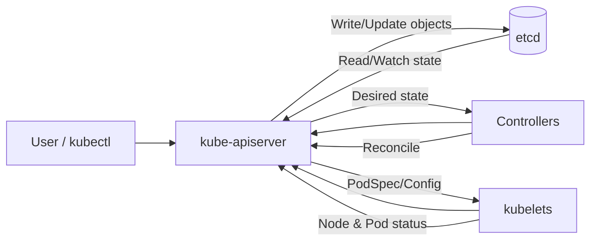

# etcd In-Depth Notes (Kubernetes The Hard Way)

## 1) What does "stateless" mean in Kubernetes?
A stateless component does not keep durable cluster data in its own local memory/disk across requests.

- `kube-apiserver` is mostly stateless.
- Durable cluster state is stored in `etcd`.
- Because state is in `etcd`, multiple API servers can run behind a load balancer.

## 2) How Kubernetes stores and retrieves state from etcd

### Store flow (write)
1. `kubectl apply` sends request to `kube-apiserver`.
2. API server authenticates/authorizes/validates the request.
3. API server writes the object into `etcd`.

### Retrieve flow (read)
1. `kubectl get` hits `kube-apiserver`.
2. API server reads from `etcd`.
3. API server returns the response.

### Reconcile/watch flow
1. Controllers and kubelets watch the API server.
2. API server serves state changes backed by `etcd`.
3. Components act and post status updates back via API server.

## 3) `systemctl daemon-reload` (for etcd service work)
`systemctl daemon-reload` tells `systemd` to re-read unit files.

Internally it:
- reloads unit definitions (`*.service`, `*.socket`, etc.)
- rebuilds dependency graph
- refreshes in-memory unit metadata

It does **not** restart services.

## 4) `systemctl enable etcd` vs `systemctl start etcd`
- `systemctl enable etcd`: start etcd automatically on boot.
- `systemctl start etcd`: start etcd now.

Typical pattern:
1. `enable`
2. `start`

## 5) Understanding `etcdctl member list` output
Example:

`6702b0a34e2cfd39, started, controller, http://127.0.0.1:2380, http://127.0.0.1:2379, false`

Meaning:
- `6702b0a34e2cfd39` = member ID
- `started` = member is running
- `controller` = member name
- `http://127.0.0.1:2380` = **peer URL** (etcd-to-etcd traffic)
- `http://127.0.0.1:2379` = **client URL** (`etcdctl`, kube-apiserver)
- `false` = not learner => this is a **voting member**

## 6) Why peer URL and client URL are different
They separate traffic types:
- Peer URL: internal Raft replication and consensus traffic.
- Client URL: external read/write API traffic.

This improves clarity, isolation, and operational safety.

## 7) What is learner vs voting member
- **Voting member**: participates in quorum and leader election.
- **Learner**: receives replication but does not vote.

Learner is used when adding new members safely:
1. add as learner
2. let it catch up logs/snapshot
3. promote to voting member

## 8) Why etcd needs voting at all
etcd uses Raft consensus. Voting is needed to:
- elect one leader safely
- commit writes only with majority agreement
- avoid split-brain/conflicting cluster state

Result: strong consistency for Kubernetes cluster state.

## 9) Why configure peer URL even in single-member etcd
Even with one member:
- client URL is needed immediately (`2379`)
- peer URL is part of standard Raft/member configuration and future scaling (`2380`)

So peer URL is structurally required/future-ready, even if no second member exists yet.
